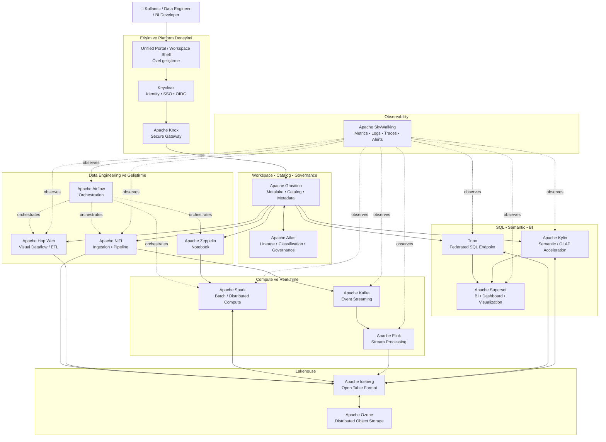
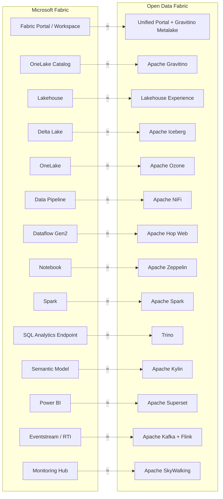
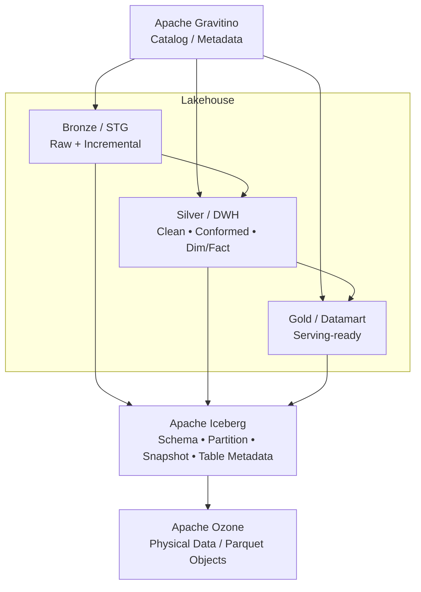
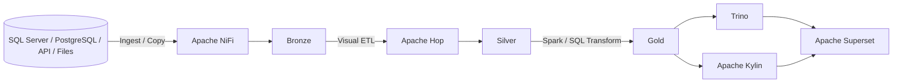

# Open Data Fabric — Apache Ağırlıklı Referans Mimari

> Amaç: Microsoft Fabric'teki temel deneyimleri mümkün olduğunca Apache/açık kaynak bileşenlerle karşılayan, on-prem / cloud / hybrid çalışabilen birleşik veri platformu.

## 1. Üst Seviye Mimari



## 2. Fabric ile Katman Eşleştirmesi



## 3. Lakehouse İç Yapısı



## 4. Kullanıcı Deneyimi — Fabric Benzeri Portal

```text
┌──────────────────────────────────────────────────────────────────────┐
│                         OPEN DATA FABRIC                             │
├──────────────────────────────────────────────────────────────────────┤
│ Workspace: Sales Analytics                         User: selim       │
│                                                                      │
│  + New                                                               │
│                                                                      │
│  🗄 Lakehouse        → Gravitino + Iceberg + Ozone                   │
│  🔀 Pipeline         → Apache NiFi                                   │
│  🧩 Dataflow         → Apache Hop Web                                │
│  📓 Notebook         → Apache Zeppelin + Spark                       │
│  🧮 SQL              → Trino                                         │
│  🔷 Semantic Model   → Apache Kylin                                  │
│  📊 Report           → Apache Superset                               │
│  ⚡ Real-Time        → Apache Kafka + Flink                          │
│  🧬 Lineage          → Apache Atlas                                  │
│  📈 Monitor          → Apache SkyWalking                             │
└──────────────────────────────────────────────────────────────────────┘
```

## 5. Veri Akışı Örneği



## 6. Bileşenlerin Sorumlulukları

| Katman | Ürün | Ana sorumluluk |
|---|---|---|
| Portal | Özel geliştirme | Tek giriş noktası, workspace ve Fabric-benzeri UX |
| Identity | Keycloak | Kullanıcı, grup, SSO, OIDC/OAuth2 |
| Gateway | Apache Knox | Veri platformu servislerine güvenli erişim |
| Catalog | Apache Gravitino | Metalake, catalog, schema, table ve metadata omurgası |
| Governance | Apache Atlas | Lineage, classification ve governance |
| Storage | Apache Ozone | Dağıtık fiziksel object storage |
| Table Format | Apache Iceberg | ACID lakehouse tabloları ve metadata |
| Ingestion | Apache NiFi | Kaynaklardan veri taşıma ve akış tabanlı pipeline |
| Visual ETL | Apache Hop Web | Dataflow Gen2 benzeri görsel dönüşüm |
| Orchestration | Apache Airflow | DAG, dependency, schedule ve job orchestration |
| Notebook | Apache Zeppelin | Web notebook ve interaktif geliştirme |
| Compute | Apache Spark | Büyük ölçekli batch / distributed processing |
| SQL | Trino | Federated/ad-hoc SQL endpoint |
| Semantic / OLAP | Apache Kylin | Semantic/OLAP model ve query acceleration |
| BI | Apache Superset | Dashboard, rapor ve visualization |
| Event Streaming | Apache Kafka | Event ingestion / event bus |
| Stream Compute | Apache Flink | Stateful real-time processing |
| Observability | Apache SkyWalking | Metrics, logs, traces, alerts ve topology |

## 7. Tasarım İlkesi

Platformun merkezi yalnızca storage değildir:

```text
                    Unified Portal
                          │
                    Apache Knox
                          │
                  Apache Gravitino
                   (mantıksal omurga)
                          │
       ┌──────────────────┼──────────────────┐
       │                  │                  │
 Data Engineering       SQL / BI          Streaming
       │                  │                  │
       └──────────────────┼──────────────────┘
                          │
                    Apache Iceberg
                          │
                    Apache Ozone
                   (fiziksel omurga)
```

**Gravitino = mantıksal metadata/catalog omurgası**  
**Iceberg = lakehouse tablo katmanı**  
**Ozone = fiziksel veri omurgası**  
**Portal = bütün bileşenleri tek ürün deneyiminde birleştiren katman**

## 8. Fabric'e Göre En Önemli Fark

Microsoft Fabric'te portal, identity, catalog, storage, compute, semantic model ve BI tek yönetilen ürün deneyimi içinde gelir. Bu mimaride teknik motorların büyük bölümü hazır açık kaynak projelerden oluşur; bizim geliştirmemiz gereken temel değer **bu motorları tek workspace, ortak yetkilendirme, ortak metadata ve tutarlı kullanıcı deneyimi altında birleştirmektir.**

> Not: Trino ve Keycloak Apache Software Foundation projesi değildir; mevcut tasarımda teknik ihtiyaç nedeniyle bilinçli olarak korunmuştur.
